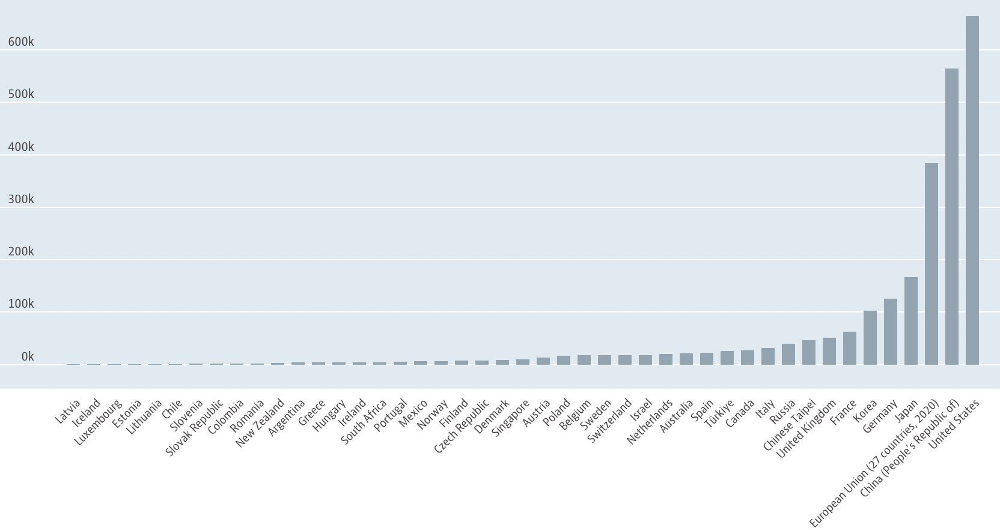
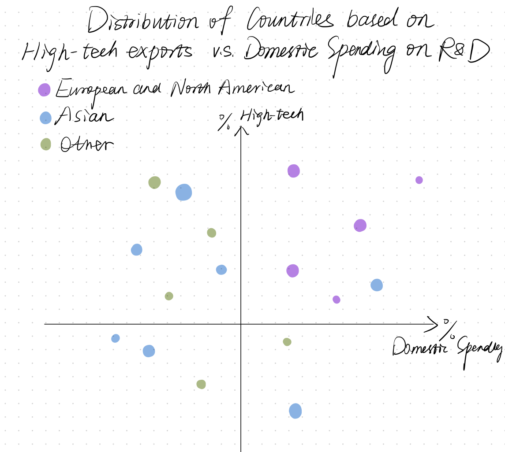
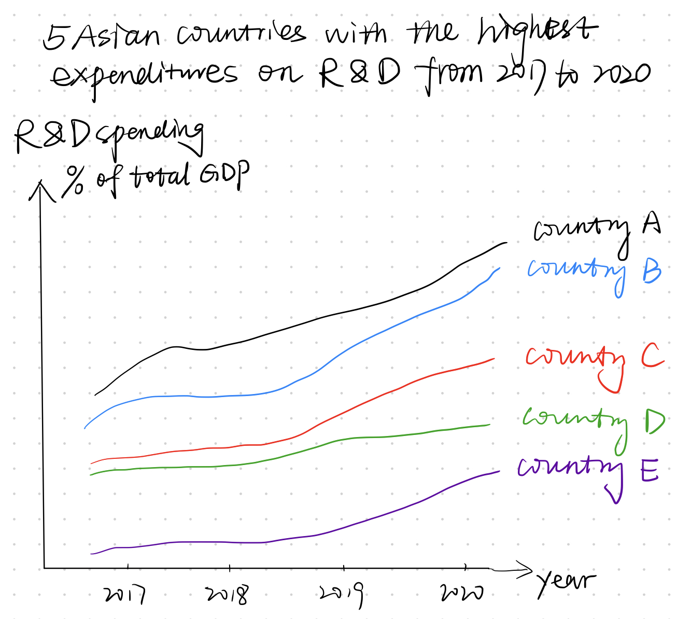

# Final project Part 1

## Outline
The ability of research and development in technology is one of the most important measurements for the innovation and competition of a country. The demand of high-tech talents is growing fast these years especially in the newly emerging industries. These talents are regards as the strong momentum currently and in the future. Therefore, the insight of the R&D fields can provide a reference for investors to invest in the technology market, as well as policy makers to make innovation decisions. 

Setup: Individuals, businesses, governments, and the world all take benefit from innovation and R&D. 

Conflict: Nowadays R&D in the technology field is more and more crucial for a country to be competitive and innovative in the global world, and for a business to transform operations. 

Resolution: For investors, countries with a high R&D capacity are potential to invest. For policy makers, to increase their expenditures on R&D and attract high-tech talents can help to improve their innovation capacity. 

## Sketching
Below are some initial sketches of the data visualization in this project.

### Dataviz 1
The first graph will be a bar chart to present countries sorted by expenditures on R&D (million US dollars) as an overview of the world's top level of R&D expenditures. (The below sketching is a screenshot of OECD data)

### Dataviz 2
The second graph will be a scatterplot to present the distribution of countries showing the relationship between the high-tech exports and R&D expenditures (both of them are notated as percentage), and the size of points indicates the number of researchers. 

### Dataviz 3
The third graph will focus on the trends of 5 Asian developing countries with the highest R&D expenditures. The purpose of this graph is to present progress that the Asian countries made and provide insights of their innovation potential in the future. 

## Reflection
1. I want to add some graphs like stacked plots to show the industries in detail, but I am still looking for official public data. 

2. Another thing I need to improve is to make my story line clear. At present, these graphs seem to be independent. More details and facts should be added into the story in the final version. 

## Data
Data used in this project is mainly from World Bank and OECD database. 

1. High-technology exports: [World Bank](https://data.worldbank.org/indicator/TX.VAL.TECH.MF.ZS?most_recent_year_desc=true&view=chart) 

This dataset presents high-technology exports (% of manufactured exports) by country and year.

2. Gross domestic spending on R&D: [OECD](https://data.oecd.org/rd/gross-domestic-spending-on-r-d.htm)

Gross domestic spending on R&D is defined as the total expenditure (current and capital) on R&D carried out by all resident companies, research institutes, university and government laboratories, etc., in a country. It includes R&D funded from abroad, but excludes domestic funds for R&D performed outside the domestic economy.

3. Researchers: [OECD](https://data.oecd.org/rd/researchers.htm#indicator-chart) 

Researchers are professionals engaged in the conception or creation of new knowledge, products, processes, methods and systems, as well as in the management of the projects concerned. This indicator is measured in per 1 000 people employed and in number of researchers; the data are available as a total and broken down by gender.

## Medium and method
I plan to present my final project using Shorthand, which allows me to tell a story in an interactive and logical way with graphs and words. I love the idea to show the timeline by scrolling the screen, and the graphs step by step rather than appearing at once. 

The data visualization will be designed by Tableau and Flourish. Both of them can present the data interactively with details by selecting a specific item. Tableau is more flexible to edit fields and calculate values if any data processing is needed, while Flourish is easier to use when additional manipulation on data value is not required. 

# End 
### Back to the [portfolio page](README.md)
