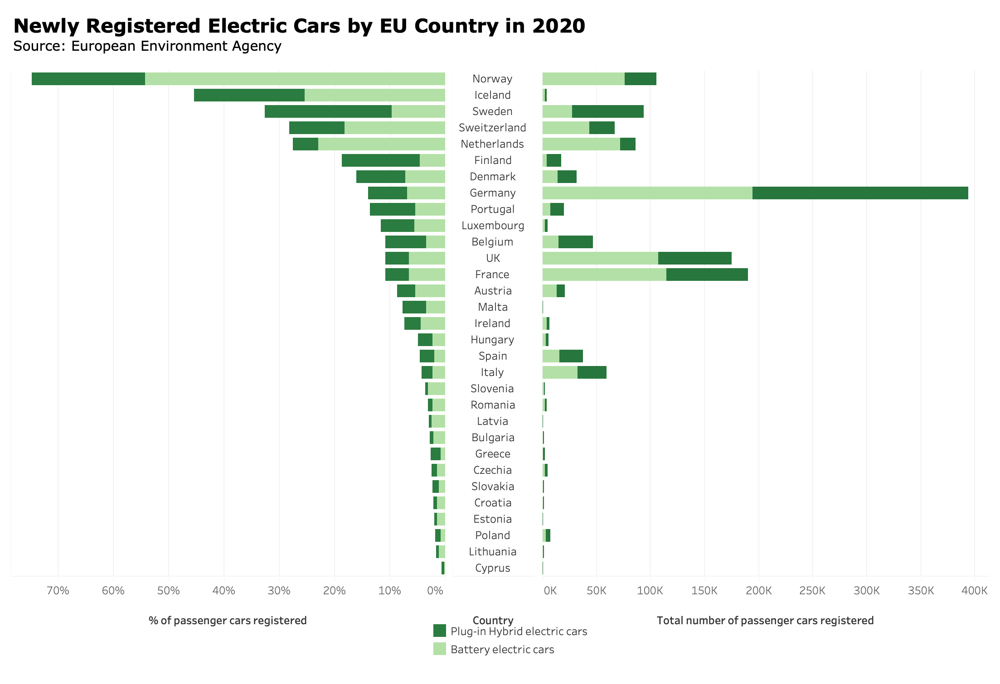

# 1. The original data visualization
The data visualization used in this assignment is from European Environment Agency (link: https://www.eea.europa.eu/data-and-maps/figures/new-electric-vehicles-by-country). The original data visualization shows as follow:

# 2. Critique the data visualization
Question1: Describe your overall observations about the data visualization here.  What stood out to you?  What did you find worked really well?  What didn't?  What, if anything, would you do differently?  

In this data visualization, I noticed Norway is the toppest country with the highest percentage of newly registered electric cars in 2020, followed by Iceland. I found that 2 things worked well here. 
1. Color: using two green colors distinguished by light and dark makes it sense becuase green has the meaning of the clean energy and environmental-friendly, and the comparison of two kinds of vehicles is very clear. 
2. Sort: the graph is sorted by the percentage of newly registered electric cars, so it’s very clear and easy for audience to recognize countries with highest newly registered percentage. 
However, there are 3 points making it less informative and understandble. 
1. The second graph is too far away from country names at the extreme left side, making it very hard for audience to match the name on the left and the number on the right. It would be better if the name axis is put at the center so that both graphs can refer to it clearly. 
2. There is no grid line or mark to help the audience to recognize the number for each bar, so the audience can only get a general overview of the relative comparison rather than a specific number. It would be better to set grid line at the background to offer the reference for audience to track the specific number. 3. Same color usage in both graphs can confuse the audience with the same meaning. It would be better if two graphs use two schemes of color, like green and blue, because the two graphs have different meanings. 

Question2: Who is the primary audience for this tool?  Do you think this visualization is effective for reaching that audience?  Why or why not?

The primary audience for this tool is those who care about the EU electric vehicle industry, more specifically, for example, electric vehicle manufacturers, investors, companies in the supply chains, and governments that design enviroment policies. This visualization is partially effective for reaching the audience. On the one side, it provides an informative overview that how electric vehicles are popular in EU countries by showing the percentage in each country, and how large the market is by showing the specific number for each country. On the other side, nearly half of the countries’ number cannot be presented clearly since the number is very small, making it meaningless to show in the graph because the audience may not get any useful information for these countries. 

Question3: Final thoughts: how successful what this method at evaluating the data visualization you selected? Are there measures you feel are missing or not being captured here?  What would you change?  Provide 1-2 recommendations (color, type of visualization, layout, etc.)

This method is successful at a general level of content and information. It mainly focuses on how accurate and understandable the information provided in the graph. Absolutely, it should be the most important factor to measure the success of a visualization because it is the goal. However, the measuring method should involve some factors with details and specific standards, which indicates how to measure usefulness, truthfulness, intuitiveness, and so on. People have different standard in their mind, and pay attention to different aspects when measuring a visualization. I would recommend to add specific visualizing aspects when asking each criterion. For example, when asking aesthetics, I would give a hint to care about the usage of colors. When asking intuitiveness, I would give a hint to care about the title, name of axises, and necessary notation in the graph. 

# 3. Sketch out a solution
Here is the sketching of the redesign idea:

Ideas:
1. Change the color from green to blue on the right graph in order to make it different from the information presented on the left. 
2. Move the country axis from the left to the center to make it easier to match bars to countries. 
3. Add grid lines to provide the reference to the percentage and number.
4. Adjust the x-axis of the right graph from 0-400k to 0-225k. (However, it didn't perform as I expected, so I wouldn't take this idea in my final solution.)

# 4. Test the solution
Question list:
1. Can you tell me what this graph is about?
2. Is there anything you find confusing, in other word, you spend some seconds thinking about the information?
3. Who do you think is the intended audience for this?
4. What would you like to change to make it more sense?

Feedback from interviews

Student A, mid 20's
1. Can you tell me what this graph is about?
It shows the percentage and the number of newly registered electric vehicles in the EU countries. There are two kinds of vehicles: battery electric vehicles and plug-in hybrid electric vehicles. 
2. Is there anything you find confusing, in other word, you spend some seconds thinking about the information?
There is no need to use two schemes of color because colors indicate the same meaning in both two graphs. There are so many rows and the number of newly registered vehicles is very small so it cannot be presented very clearly. 
3. Who do you think is the intended audience for this?
The audience is those who cares about EU electric vehicles market such as investors, EV manufacturers, as well as traditional fuel vehicles companies which are looking for the strategic transition. 
4. What would you like to change to make it more sense?
Cut countries from Slovenia to the end. Use green on the right instead of blue. 

Student B, mid 20's
1. Can you tell me what this graph is about?
It shows the information about the percentage of newly registered electric cars in the domestic market, and the total number in that country. It's obvious to find that Norway has the highest percentage of electric vehicles purchasd and registered, while Germany has the most total number.  
2. Is there anything you find confusing, in other word, you spend some seconds thinking about the information?
It doesn't make sense that the x-axis is at the scale from 0 to 200k+ but the actual number is almost 400k. 
3. Who do you think is the intended audience for this?
The audience is people who care about and are interested in the EU EV market, for example, stock holders, and vehicle manufacturers. 
4. What would you like to change to make it more sense?
The label of x-axis in the left graph can be notated as "%" instead of "percentage", more understandable. 

# 5. Build your solution
According to my ideas and feedbacks from interviewees, my final solution is presented as follow:

(image version)

(interactive version from Tableau Public)

<noscript></noscript><object class='tableauViz'  style='display:none;'><param name='host_url' value='https%3A%2F%2Fpublic.tableau.com%2F' /> <param name='embed_code_version' value='3' /> <param name='site_root' value='' /><param name='name' value='redesign-NewRegisteredElectricCars&#47;Dashboard1' /><param name='tabs' value='no' /><param name='toolbar' value='yes' /><param name='static_image' value='https:&#47;&#47;public.tableau.com&#47;static&#47;images&#47;re&#47;redesign-NewRegisteredElectricCars&#47;Dashboard1&#47;1.png' /> <param name='animate_transition' value='yes' /><param name='display_static_image' value='yes' /><param name='display_spinner' value='yes' /><param name='display_overlay' value='yes' /><param name='display_count' value='yes' /><param name='language' value='zh-CN' /><param name='filter' value='publish=yes' /></object>

I further developed my ideas to redesign this visualization after getting feedbacks from interviewees. 
1. Change the color back from blue to green, because colors in both graphs represent the same information, which is battery electric vehicles and plug-in hybrid electric vehicles. Blue takes the audience more time to think about the meaning of it. 
2. Keep all countries in the dataset. Considering the targeted audience and the purpose of this visualization, I realize that one of the most important thing is to keep the completeness of the information because our purpose is to show an overview of the EU market rather than focusing on the top. In addition, it's hard to decide the selection criteria if I want to reduce the presented countries. According to the criterion methods mentioned before, I keep all countries meeting the requirement of usefulness and completeness.
3. Keep the original x-axis in the right graph. According to the criterion method of perceptibility, cutting down the axis doesn't make any sense and will cause a illogical comparison. We can use the interactive method to show the specific number in Tableau. 
4. Rewrite the title and x-axis label to give more information about the graph, including topic, subjects, year, and percentage notation. 

# 6. Problem and reflection
1. Limited by technical reasons, I cannot show the total number at the end of each bar in both graphs. I want to add a number to help the audience find the number in a easier way. We can achieve this goal by the interactive version, but cannot if the graph is presented as an image. 
2. So many rows here cannot easily provide information in a clear way. It's like a delemma to choose completeness or clearness. However, I choose completeness in this case since the visualization serves the purpose, which is to present the whole EU market. 
3. The layout of Tableau Public inserted looks weird. I have no idea how to adjust it to a proper looking. 

# End 
[Back to the main page](README.md)
